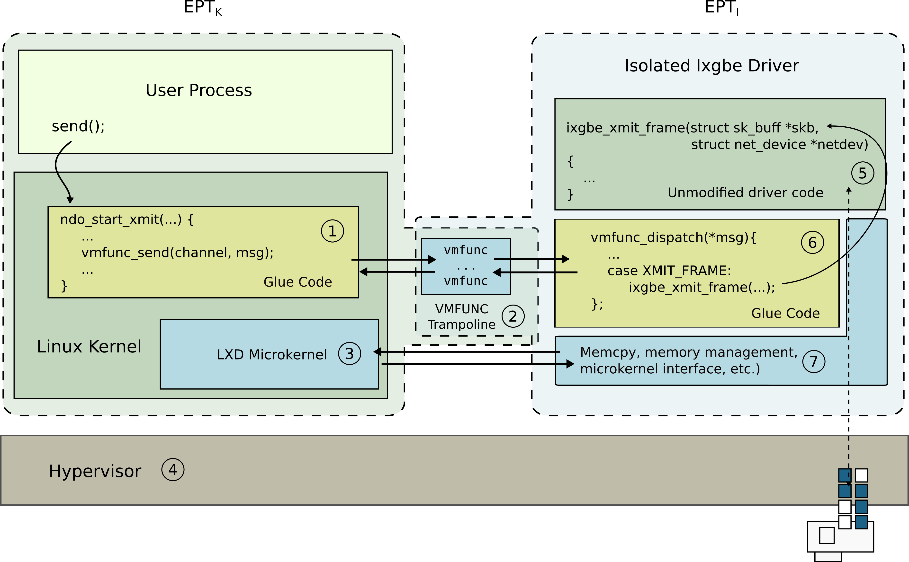

---
title: Fine-grained kernel isolation
aliases:
- /kernel-isolation

ShowReadingTime: false
---

Today, the lack of isolation within an operating system kernel is one of the
main factors undermining its security. While the core kernel is relatively
stable, the number of kernel extensions and device drivers is growing with
every hardware generation (a modern Linux kernel contains around 8,867 device
drivers, with around 180-130 drivers running on a typical system). Developed by
third-party vendors that often have an incomplete understanding of the kernel
programming and security idioms, kernel extensions and device drivers are a
primary source of vulnerabilities in the kernel. While modern kernels deploy a
number of security mechanisms to protect their execution, e.g., stack canaries,
address space randomization (ASLR), data execution prevention (DEP),
superuser-mode execution (SMEP) and access (SMAP) prevention, a large fraction
of vulnerabilities remain exploitable. Even advanced defense mechanisms like
code pointer integrity (CPI) and safe stacks that are starting to make their
way into the mainstream kernels remain subject to data-only attacks that become
practical when combined with automated attack generation tools.  

Why do we run monolithic kernels? The reason is twofold. First, for many years,
isolation was prohibitively slow due to the lack of low-overhead architectural
isolation mechanisms. For many years, monolithic kernels remained the only
practical design choice for performance. Second, the complexity of a
monolithic, shared-memory kernel prevents a trivial decomposition effort.
Decomposition requires cutting through a number of tightly-connected,
well-optimized subsystems that use rich interfaces and complex interaction
patterns. Several attempts to decompose the kernel code failed due to a lack of
proper abstractions and automation tools.

We work on a range of projects aimed at bringing practical low-overhead
isolation to full-featured commodity kernels. 

Lightweight Execution Domains: [lxds](../lxds)

Lightweight Virtualized Domains: [lvds](../lvds)

KSplit: [ksplit](../ksplit) 

# Publications

Yongzhe Huang, Vikram Narayanan, David Detweiler, Kaiming Huang, Gang Tan,
Trent Jaeger, and Anton Burtsev.  **KSplit: Automating Device Driver
Isolation**.  In _16th USENIX Symposium on Operating Systems Design and
Implementation (OSDI '22)_, July 2022.
[pdf](https://mars-research.github.io/doc/)

\[**Best paper award**\] Vikram Narayanan, Yongzhe Huang, Gang Tan, Trent
Jaeger, and Anton Burtsev. **Lightweight Kernel Isolation with Virtualization
and VM Functions**. In _16th ACM SIGPLAN/SIGOPS International Conference on
Virtual Execution Environments (VEE 20)_, March 2020.
[pdf](https://mars-research.github.io/doc/lvds-vee20.pdf)

Vikram Narayanan, Abhiram Balasubramanian, Charlie Jacobsen, Sarah Spall, Scott
Bauer, Michael Quigley, Aftab Hussain, Abdullah Younis, Junjie Shen, Moinak
Bhattacharyya, and Anton Burtsev. **LXDs: Towards Isolation of Kernel
Subsystems**.  In _2019 USENIX Annual Technical Conference (USENIX ATC 19)_,
July 2019. [pdf] (https://mars-research.github.io/doc/lxds-usenix19.pdf) 
