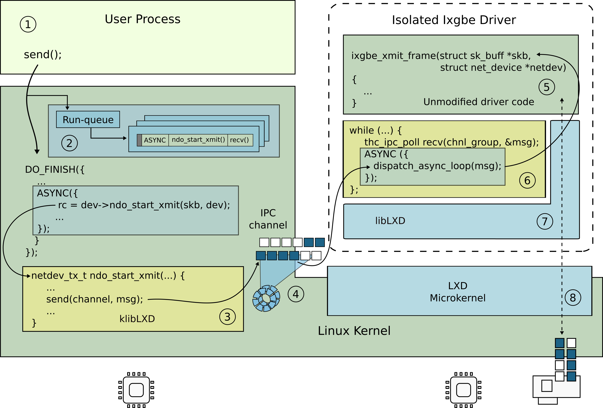

Modern operating systems are monolithic. Today, however,lack of isolation is
one of the main factors undermining security of the kernel. Inherent complexity
of the kernel code and rapid development pace combined with the use of
unsafe,low-level programming language results in a steady streamof errors.
Even after decades of efforts to make commodity kernels more secure, i.e.,
development of numerous static and dynamic approaches aimed to prevent
exploitation of mostcommon errors, several hundreds of serious kernel
vulnerabilities are reported every year. Unfortunately, in a monolithic kernel
a single exploitable vulnerability potentially providesan attacker with access
to the entire kernel.

Modern kernels need isolation as a practical means of confining the effects of
exploits to individual kernel subsystems. Historically, introducing isolation
in the kernel is hard. First, commodity hardware interfaces provide no support
for efficient, fine-grained isolation. Second, the complexity of amodern kernel
prevents a naive decomposition effort.

Lightweight Execution Domains (LXDs) takes astep towards enabling isolation in
a full-featured operating system kernel. LXDs allow one to take an existing
kernelsubsystem and run it inside an isolated domain with minimal or no
modifications and with a minimal overhead. We evaluate our approach by
developing isolated versions of several performance-critical device drivers in
the Linux kernel.

LXDs are available as two git repositories:

LXDs-compatible Linux kernel: [xcap-capability-linux](https://gitlab.flux.utah.edu/xcap/xcap-capability-linux)

Interface Definition Language (IDL): [lcds-idl](https://gitlab.flux.utah.edu/xcap/lcds-idl)
